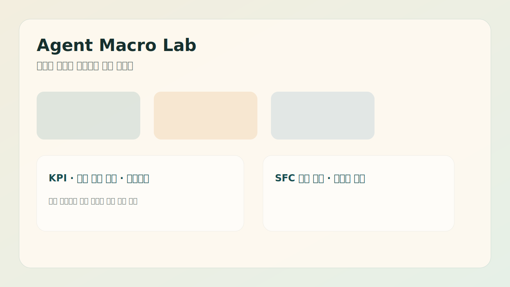

# Agent Macro Lab

## 프로젝트 소개

데이터 보정형 거시경제 정책 실험실입니다. 가계, 기업, 정부, 금융시장, 자산시장, 대외부문이 상호작용하는 교육용 시뮬레이터로, 정책 변화가 GDP, 물가, 실업률, 부채, 신용, 자산시장에 전달되는 경로를 실험합니다.

> 이 도구는 실제 투자 판단이나 정책 결정에 사용할 수 있는 예측기가 아닙니다. 경제 구조와 정책 전달 경로를 탐구하기 위한 실험용 모델입니다.

## 스크린샷



현재 이미지는 임시 placeholder입니다. 실제 실행 화면 캡처는 로컬 앱을 실행한 뒤 `docs/screenshot.png`로 교체할 예정입니다. 이 작업 환경에서는 브라우저 보안 정책이 `127.0.0.1` 접근을 차단해 자동 캡처를 만들 수 없었습니다.

## 실행 방법

ES modules를 사용하므로 로컬 정적 서버에서 실행하는 것을 권장합니다.

```powershell
git clone <repository-url>
cd economics
python -m http.server 8788
```

브라우저에서 다음 주소를 엽니다.

```text
http://127.0.0.1:8788/index.html
```

## 주요 기능

- 거시 KPI: GDP, 소비, 투자, 실업률, 물가, 정책금리, 정부재정, 가계/기업 상태
- 정책 조작: 정책금리, 소득세, 법인세, 부가세, 정부지출, 기준임금, 물가 민감도
- 금융/자산시장: 국채금리, 신용스프레드, 은행심리, 주식, 부동산, 금/은, 신용 사이클
- 심리/정보: 소비심리, 기업심리, 시장 위험심리, 정보격차, 행동경제 편향
- 시나리오: 안정 성장, 고금리 긴축, 원자재 충격, 금융불안, 역사형 시나리오
- 분석 도구: 정책 비교, 원인 분해, 조기경보등, 120개월 빠른 테스트
- 데이터 보정: recursive response function 기반 캘리브레이션, 변수별 적합도 진단, 백테스트, 몬테카를로 불확실성 분석
- Liquidity Radar: FRED live/fallback 데이터로 현금 유동성, 신용 유동성, 자산시장 유동성 관측
- SFC 보조 레이어: 부문별 balance sheet와 flow ledger, 회계 일관성 검증

## 모델 구조

```text
index.html
styles/main.css
src/
  main.js                  # 얇은 browser entrypoint
  app/
    createApp.js           # 앱 facade, runtime registry와 bootstrap 조립
    appBootstrap.js        # DOM cache, chart setup, 초기 reset/render 순서
    actionRegistry.js      # 이벤트 handler를 simulation/scenario/dataLab 등으로 그룹화
    runtimeRegistry.js     # legacy/agent/experiment/developer runtime 생성 registry
  core/
    config.js              # 공통 상수와 정책 전달 메타데이터
    stateFactory.js        # 초기 앱 상태 생성
    domainStateFactory.js  # 자산, 금융, 심리, 대외, 계층 등 domain 초기 상태 생성
    resetSimulation.js     # 시뮬레이션 상태 재초기화 orchestration
    simulationEngine.js    # tick 실행 순서와 안전 wrapper
    serviceRegistry.js     # tick phase별 runtime service 묶음 생성
    mathUtils.js           # 안전 수치, clamp, 평균, Gini 등 공통 유틸
    formatUtils.js         # 라벨, 등급, 상태 표시용 순수 helper
    calibration.js         # 공식/샘플 보완 데이터 기반 파라미터 보정과 변수별 loss 진단
    backtest.js            # recursive simulated path 기반 과거 구간 검증
  runtime/
    legacyRuntimeImpl.js   # 기존 대형 legacy runtime 구현부(추가 세분화 예정)
  analysis/
    causalDecomposition.js # 원인 분해
    earlyWarning.js        # 조기경보등
    marketOutcome.js       # 시장 성공/실패 평가
  economy/
    sectorProfiles.js      # 산업별 민감도와 전략 helper
    accountingAdapter.js   # SFC 보조 회계 레이어 연결
    laborMarket.js         # 고용, 해고, 임금 지급 노동시장 엔진
    production.js          # 생산량, 가격 조정, 기대수요 엔진
    consumption.js         # 계층별 소비, 세금 체감, 신용/심리 기반 구매 엔진
    government.js          # 정부지출, 이윤세, 세후 현금흐름 배분 엔진
    externalTrade.js       # 대외수요, 환율, 수입물가, 외국 주체 전송 경로
    macroMetrics.js        # GDP, 물가, 실업률, 재정, 분배 지표 집계
    responseFunctions.js   # 단순화된 거시 반응식
  finance/
    interestRates.js       # 금리 구조, 국채시장, 실질금리 전송 경로
    banking.js             # 은행 건전성, 신용공급, 스프레드, 은행심리
    creditCycle.js         # 신용 과다/경색 국면과 잔류 이벤트
    safeAssets.js          # 안전자산 선호와 금/은 시장 보조 계산
  models/
    economicModels.js      # 모델 분석실 순수 계산 함수
    modelDefinitions.js    # 모델 분석실 입력 정의
  data/                    # 로컬 데이터 adapter와 변환 함수
  liquidity/               # FRED 유동성 series, 점수, regime 분류
  scenarios/               # 시나리오 선택 데이터
  ui/
    domCache.js            # DOM id cache registry
    events.js              # 이벤트 바인딩 orchestration
    controls.js            # 시나리오 select hydration
    dataLab.js             # 데이터 보정, 백테스트, 몬테카를로 UI
    liquidityRadar.js      # Liquidity Radar UI
data/
  sample_korea_macro.json
  sample_us_macro.json
```

현재 아키텍처는 기존 거대 `src/main.js`에서 reset, tick 실행 순서, 소비, 정부, 대외무역, 거시지표, 금리, 은행, 신용, 안전자산, inspector UI, DOM cache, 이벤트 바인딩을 단계적으로 분리한 상태입니다. 최근 단계에서는 `main.js`를 `createApp()` entrypoint로 축소하고, 초기화 흐름은 `appBootstrap`, 이벤트 연결은 `actionRegistry`, runtime 생성은 `runtimeRegistry`, tick phase 연결은 `serviceRegistry`로 정리했습니다. 기능 보존을 우선해 `core/legacyRuntime.js`는 얇은 호환 facade로 유지하고 실제 구현은 `runtime/legacyRuntimeImpl.js`로 옮겼으며, 다음 리팩터링 목표는 이를 책임별 runtime으로 더 작게 나누는 것입니다.

## 백테스트와 데이터 보정

백테스트와 캘리브레이션은 실제값을 그대로 복사하지 않고, 첫 관측값에서 시작해 공통 response function과 과거 외생 변수로 recursive simulated path를 만든 뒤 실제 데이터와 비교합니다. 캘리브레이션 결과는 기본 loss, 보정 후 loss, 개선률, 선택된 파라미터 배율, GDP/물가/실업률별 적합도를 함께 표시합니다.

백테스트의 response function 입력은 압력값을 양수로 전달하고, 금리·부채·불확실성의 방향은 반응계수의 부호가 결정합니다. 따라서 금리나 부채 부담이 증가하면 소비·투자 신호가 감소하는지 별도 회귀 테스트로 확인합니다. 이 보정은 제한된 교육용 시계열에 대한 방향·크기 탐색이며 실증 추정이나 예측 신뢰구간을 의미하지 않습니다.

데이터 보정과 백테스트 결과에는 공식 데이터 사용률도 함께 표시됩니다. 예를 들어 FRED에서 일부 지표만 불러오고 나머지를 로컬 샘플로 보완한 경우 `공식 데이터 사용률: 6/11개 지표`, `샘플 보완 5개`, `월별 정렬 및 forward-fill 사용` 같은 메타데이터를 같이 보여줍니다.

현재 기본 데이터 소스는 로컬 샘플 JSON입니다. FRED adapter는 미국 시계열 일부를 live data로 불러올 수 있고, ECOS는 일부 1차 매핑 후보와 fallback을 함께 사용합니다. OECD adapter는 공식 데이터 연동을 위한 stub 상태입니다.

GDP형 지출 집계는 `C + I + G + X - M`을 사용합니다. 수출은 소비로 중복 집계하지 않고 현재 tick의 수출 flow로 기록하며, 수입 flow를 차감합니다. 스무딩된 무역수지는 별도 진단 지표로 유지됩니다.

## 재현성과 안정화 모드

시뮬레이션 초기화에는 기본 seed가 사용되며, 같은 seed와 같은 설정에서는 난수 기반 에이전트 생성·정책 이벤트·시장 변동이 같은 순서로 재현됩니다. `npm test`로 response function 방향성, GDP 항등식, 백테스트 누수 방지, seed 재현성, 세수 중복 방지를 확인할 수 있습니다.

고급 설정의 `교육용 균형 보정`은 자연실업률 하한과 목표물가 회귀처럼 교육용 안정화 로직을 켜고 끄는 옵션입니다. NaN·Infinity 방지와 분모 보호 같은 수치 안전장치는 항상 활성화됩니다.

## Liquidity Radar

Liquidity Radar는 기존 시뮬레이션 결과를 바꾸지 않는 읽기 전용 관측 패널입니다. FRED live data 또는 로컬 fallback series를 사용해 거대 현금 유동성, 신용 유동성, 자산시장 유동성을 요약합니다.

사용 series는 `WALCL`, `WTREGEN`, `RRPONTSYD`, `M2SL`, `DPSACBW027SBOG`, `MMMFFAQ027S`, `BAMLH0A0HYM2`, `BAMLC0A4CBBB`, `CSUSHPISA`, `SP500`, `DTWEXBGS`입니다.

계산 항목은 최신값, 1/3/6개월 변화율, z-score, drawdown, `Fed Net Liquidity = WALCL - WTREGEN - RRPONTSYD`, Liquidity Score, Regime 분류입니다. Regime은 `Risk-On`, `Cash Parking`, `Credit Stress`, `Liquidity Drain`, `Mixed / Unclear` 중 하나로 표시합니다.

Fallback 결과는 실제 관측값이 아니라 교육용 샘플입니다. 패널 상단에 샘플/혼합 데이터 경고가 표시되며, FRED API key 또는 proxy를 연결하면 실제 관측값으로 전환됩니다.

FRED series는 지표마다 원 단위가 다릅니다. Liquidity Radar는 WALCL/TGA는 `백만 달러`, RRP/M2/은행예금/MMF는 `십억 달러`, OAS는 `%p`, 주가지수와 주택가격은 `지수`로 표시합니다. Fed 순유동성 계산에서는 WALCL·TGA의 백만 달러 기준에 맞추기 위해 RRPONTSYD를 십억 달러에서 백만 달러로 1,000배 환산합니다.

Liquidity Score는 현금 유동성, 신용 유동성, 자산시장 유동성의 가중 평균으로 만든 휴리스틱 관측 신호입니다. 현금 점수는 Fed 순유동성, M2, 은행예금, 머니마켓펀드, 달러지수를 참고합니다. 신용 점수는 하이일드 OAS와 BBB OAS 확대 여부를 반영합니다. 자산 점수는 S&P 500, 주택가격, drawdown을 반영합니다. 기본 z-score는 60개월 기준이며 36개월 단기 z-score를 보조로 함께 보여줍니다.

Data Confidence는 `FRED live로 불러온 series 수 / 전체 series 수`로 표시합니다. 샘플 보완 지표가 많을수록 regime 판정 신뢰도는 낮아집니다.

모든 지표는 비교 가능성을 위해 월별 기준으로 정렬됩니다. daily/weekly series는 월 내 최신 관측값 또는 forward-fill 값을 사용하므로, 고빈도 시장 압력을 실시간 tick 데이터처럼 해석하면 안 됩니다.

이 패널은 관측 신호와 교육용 해석만 제공합니다. 투자 추천, 매수/매도 판단, 시장 예측으로 사용하지 마세요.

## 공식 데이터 API 연동

데이터랩은 기본적으로 로컬 샘플 데이터를 사용하며, 선택적으로 공식 데이터 API를 실험용 보강 데이터로 불러올 수 있습니다.

- FRED: 미국 거시경제 시계열 일부를 live data로 불러올 수 있으며, 선택적으로 backend proxy URL을 지정할 수 있습니다.
- ECOS: 한국은행 경제통계 연동을 위한 adapter 구조와 일부 1차 매핑 후보가 준비되어 있으며, 미확정 통계코드는 로컬 샘플로 보완됩니다.
- OECD: 국가 비교용 SDMX adapter stub만 준비되어 있으며, 아직 실제 live 연동은 아닙니다.
- API 키: FRED와 ECOS 키는 브라우저 `localStorage`에만 저장되며 GitHub 저장소에는 포함하지 않습니다. proxy를 운영하는 경우 API key는 서버에 보관하고 프론트에는 정규화된 macro series만 전달하는 방식을 권장합니다.
- Fallback: API key 누락, 네트워크 오류, CORS 오류, 데이터 누락이 발생하면 `data/sample_korea_macro.json` 또는 `data/sample_us_macro.json`으로 자동 전환합니다.
- 데이터 정렬: FRED live data는 월별 날짜 범위로 정렬하며, GDP·정부부채처럼 분기 관측이 섞인 지표는 이전 관측값을 forward-fill해 캘리브레이션 입력 길이를 맞춥니다.
- 공개 배포: 실제 서비스 환경에서는 브라우저 직접 호출보다 backend proxy 사용을 권장합니다. 데이터랩의 고급 API 설정에서 FRED proxy URL을 지정하면 브라우저가 FRED 원본 API 대신 해당 endpoint를 호출합니다.
- FRED 수동 확인: API key 입력 → 저장 → 데이터 소스 `FRED live data` 선택 → 공식 데이터 불러오기 → 브라우저 Network 탭에서 `fred/series/observations` 요청 또는 proxy endpoint 요청을 확인합니다.
- FRED 성공 기준: 데이터랩에 `불러온 지표`가 1개 이상 표시되고, 각 지표 옆에 `FRED · 관측 개수`가 표시됩니다. 실패하거나 일부 누락되면 `샘플로 보완된 지표`와 fallback 경고가 함께 표시됩니다.
- FRED 실패 점검 순서: API key 유효성 → 브라우저 CORS/네트워크 차단 → 요청 한도 → proxy URL 설정 순서로 확인합니다.
- FRED proxy 예시: `examples/fred-proxy/`는 선택적으로 사용할 수 있는 최소 Node proxy입니다. 정적 앱 서버와 별도로 실행하며, `FRED_API_KEY`를 서버 환경변수로 보관합니다.
- 데이터 매핑 현황: `docs/data-source-mapping.md`에서 FRED/ECOS/OECD 지표별 live, 후보, fallback, stub 상태를 추적합니다.

### FRED proxy 예시

```powershell
$env:FRED_API_KEY="your-fred-api-key"
node examples/fred-proxy/server.js
```

앱의 `고급 API 설정`에서 FRED proxy URL을 다음처럼 입력합니다.

```text
http://127.0.0.1:8789/api/fred
```

이 경우 브라우저는 FRED 원본 API가 아니라 proxy endpoint를 호출합니다. 운영 배포에서는 origin 제한, rate limit, HTTPS, 서버 측 secret 관리를 추가하세요.

### 실제 스크린샷 교체

브라우저 접근이 가능한 환경에서는 앱을 실행한 뒤 첫 화면을 캡처해 `docs/screenshot.png`로 저장하고, README 이미지 경로를 `./docs/screenshot.png`로 바꾸면 됩니다. 현재 저장소에는 자동 캡처가 막히는 환경을 고려해 `docs/screenshot-placeholder.svg`를 fallback으로 유지합니다.

## 한계

- 실제 경제 예측 모델이 아닙니다.
- 샘플 데이터는 방향성 검증용 축약 데이터이며 공식 통계 원자료가 아닙니다.
- 회계 검증은 SFC 완전 모델이 아니라 기존 agent simulation 위에 얹은 보조 검증 레이어입니다.
- 자산시장과 심리 변수는 교육용 단순화 모델로 구성되어 있습니다.
- 캘리브레이션은 짧고 축약된 샘플에 대해 일부 반응계수만 탐색하므로, 전체 파라미터의 실증 추정이 아닙니다.
- 현재 SFC는 부문별 완전 대차대조표·복식부기 모델이 아니라 flow ledger와 핵심 집계의 일관성을 확인하는 보조 레이어입니다.
- 브라우저 성능을 위해 대규모 실행에서는 렌더링과 차트 업데이트가 throttling됩니다.

## 향후 계획

- `legacyRuntime` facade를 repair/diagnostic/scenario/asset/agent factory/UI runtime으로 세분화
- `serviceRegistry` 내부로 engine wrapper 등록을 더 이동하고 runtime phase 의존성 축소
- `createApp()` 내부의 남은 context/callback 의존성 축소
- 자산시장, 게임 runtime, 차트/canvas 렌더링 잔여 로직을 독립 모듈로 추가 이동
- FRED adapter 안정화 및 backend proxy 배포/보안 옵션 보강
- ECOS 실제 통계코드 매핑과 한국 공식 데이터 live 연동 확대
- OECD SDMX adapter stub을 실제 국가 비교용 live adapter로 확장
- 샘플 데이터 확장 및 공식 데이터 매핑 테이블 보강
- SFC 회계 검증 범위를 은행·대외·자산시장 flow까지 확대
- 백테스트 결과 차트와 모델 신뢰도 패널 고도화
- 브라우저 기반 회귀 테스트 자동화
- 위기 기간별 rolling backtest와 학습·검증 구간 분리
- 부문별 stock-flow balance sheet와 대출·예금·해외순자산의 완전한 복식 기록
